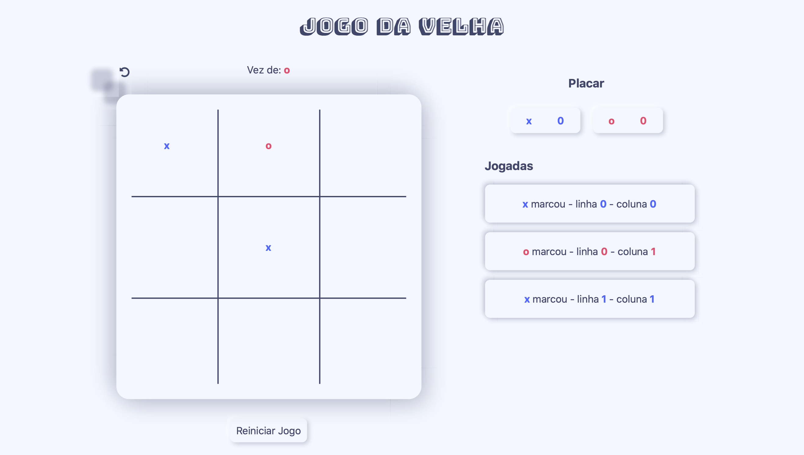
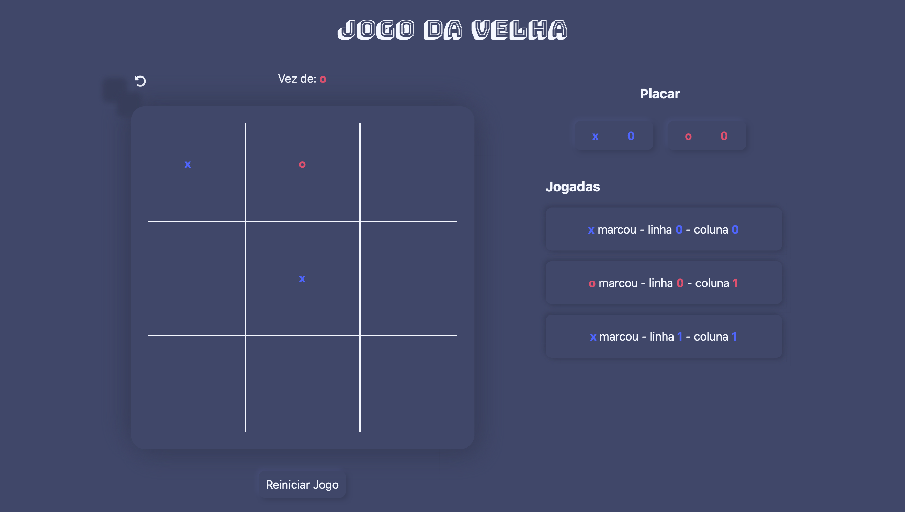
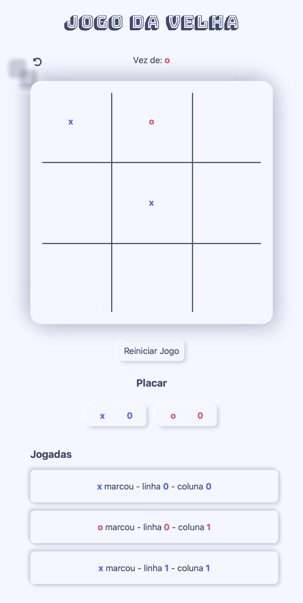
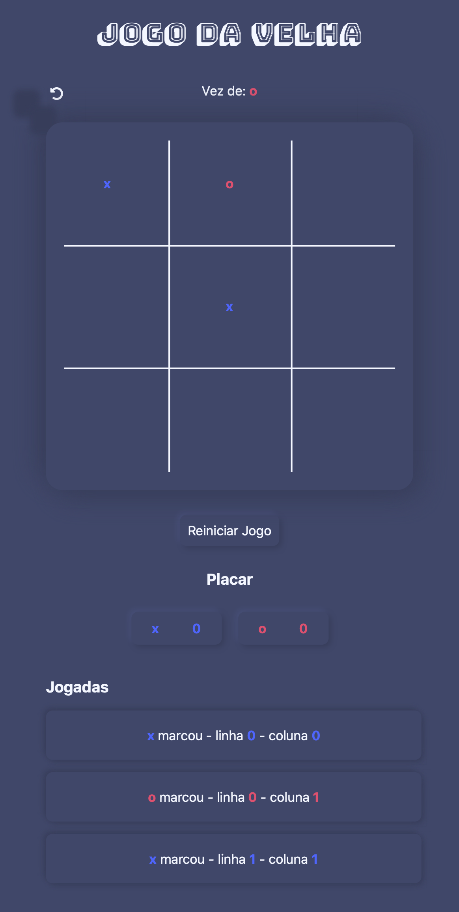

# Jogo da Velha

Projeto para aprender e colocar em prática conhecimentos de JavaScript, reactJS e nodeJS.
Desenvolvimento de um jogo da velha (tic-tac-toe).


*Interface Light*

## Estrutura do Projeto

O projeto é separado em backend e frontend, mas nesta versão preliminar são integradas. Com a aplicação rodando toda no lado do cliente, o componente react instancia um objeto contendo as regras de negócio do jogo.

A comunicação entre back e frontend é estabelecida através da emissão de eventos em um formato implementado da seguinte forma:

````
on(event, callback){

    this._listenners.push({
        event: event,
        callback: callback
    })

}

emit(event, params){
    
    this._listenners.forEach(listenner => {
        
        if(listenner.event == event){
            listenner.callback(params)
        }

    });
}
````

Quem quer que se interesse, se cadastra no evento pela função on, passando como parâmetros em qual evento quer se inscrever e qual a função deve ser chamada quando o evento for disparado.

### Backend

Apenas uma classe (JogoDaVelha) é responsável pelas regras de negócio do jogo.
3 funções devem ser chamadas para comandar o jogo.

- play. Recebe como parâmetros linha e coluna ao qual será marcado a escolha de jogada do jogador corrente. Os jogadores são alternados automaticamente.
- undoPlay. retorna uma jogada.
- restart. reinicia o jogo alternando o jogador que deve iniciar a partida 

5 eventos são disparados:

- boardChanged. Quando o tabuleiro é modificado por uma jogada ou reinicialização do jogo. É passado informações do tabuleiro como parametro.
- historyChanged. Quando o histórico de jogadas é modificado por uma jogada ou reinicialização do jogo. Recebe como parâmetro o histórico de jogadas.
- playerChanged. Quando o jogador corrente, próximo a jogar, é modificado. Recebe como parâmetro o novo jogador corrente.
- finished. Quando o termina com vitória ou empate. Recebe como parâmetro o status: 'vitória', 'empate', quem venceu, e qual coluna, linha ou diagoanal resultou na vitória.
- scoreChanged. quando termina um jogo e o placar é modificado. Recebe como parâmetro o placar do jogo.

### Frontend

Composto por um único componente react que mostra ao usuário os comandos básicos do jogo.

Foram implementados temas light e dark que se alternam de acordo com a preferência do sistema.


*Interface Dark*

Desenvolvido sob um design responsivo para melhor se adequar a diferentes telas.
<div style='display:flex; flex-direction: row'>
<figure width='50%'>
</img>
<figurecaption>Interface Light em telas menores</figurecaption>
</figure>

<figure width='50%'>
</img>
<figurecaption>Interface Dark em telas menores</figurecaption>
</figure>
</div>

## Histórico

- 0.0.1 
    - Versão preliminar do jogo rodando inteiramente no lado do cliente.

## Autor

Victor Fonseca

<p align="left">
<a href="mailto:victor.sf@live.com" target="blank"></a>
<a href="https://linkedin.com/in/victorsfonseca" target="blank"></a>
<a href="https://fb.com/victorsfonseca" target="blank"></a>
<a href="https://instagram.com/victorsfonseca" target="blank"></a>
</p>
